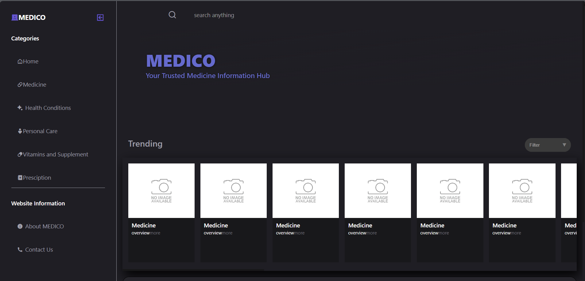
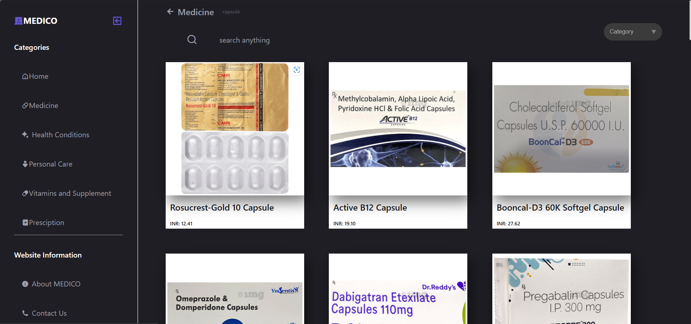
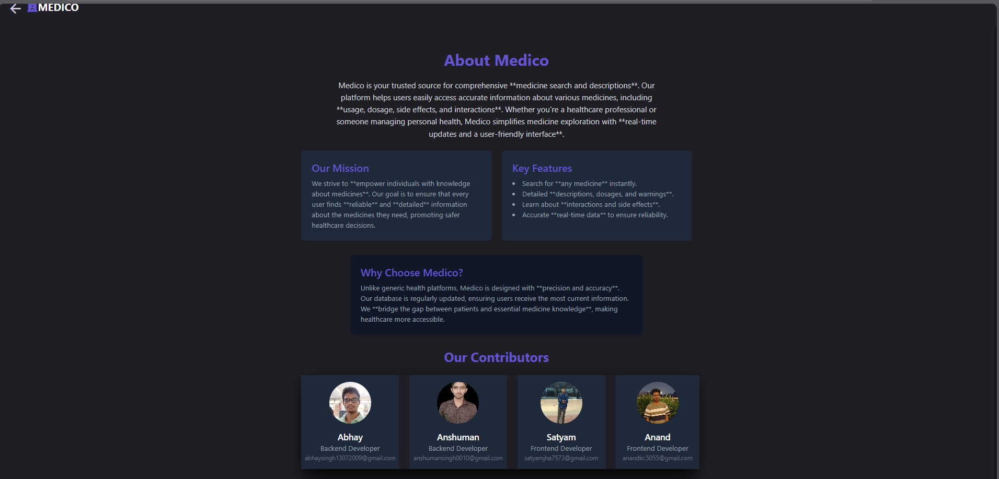

# MEDICO - Your Trusted Medicine Information Hub

Welcome to *MEDICO*, a comprehensive platform designed to provide users with accurate and up-to-date information about various medicines, including usage, dosage, side effects, and interactions. Our mission is to empower individuals with knowledge to make informed healthcare decisions while promoting safer healthcare practices.

## Overview

MEDICO is a user-friendly website that simplifies medicine exploration with real-time updates. It offers categorized sections for easy navigation and a search functionality to quickly find information on medicines, health conditions, personal care, vitamins and supplements, and prescriptions. Unlike generic health platforms, MEDICO stands out by bridging the gap between patients and essential medicine knowledge, ensuring accessibility with a focus on precision and a seamless user experience.

### How MEDICO Differs from Others
- *Real-Time Updates*: Provides the latest medicine information, setting it apart from static health websites.
- *User-Centric Design*: Intuitive interface with categorized navigation, making it easier than cluttered multi-purpose health portals.
- *Comprehensive Coverage*: Includes detailed descriptions of interactions, dosage, and side effects, going beyond basic overviews offered by competitors.
- *Specialized Focus*: Tailored specifically for medicine and health-related queries, unlike general search engines or broad health apps.
- *Community-Driven Contributions*: Features a team of dedicated developers, ensuring continuous improvement and reliability.

## Webpage Description

Based on the screenshots, MEDICO offers a sleek, dark-themed interface with the following key sections:

- *Home Page*: Displays a welcoming "MEDICO - Your Trusted Medicine Information Hub" title, a trending section with medicine cards (currently showing "NO IMAGE AVAILABLE" placeholders), and quick links to categories like Medicine, Ayurveda, Vitamins & Supplements, and Health & Condition. A "Get In Touch" section includes contact details (+91-2928034939, medico@gmail.com).
- *Contact Us Page*: Features a simple form with fields for Name, Email, and Message, accompanied by a purple "Submit" button, set against a dark background for a clean look.
- *Medicine Category*: Shows a grid of medicine cards under the "Medicine" category, each labeled "Medicine" with "overview more" links, though images are placeholders ("NO IMAGE AVAILABLE").
- *Personal Care Category*: Similar to the Medicine category, displays a grid of cards labeled "Medicine" (likely a placeholder or error), with no images available.
- *About Page*: Provides an overview of MEDICO’s mission to empower users with knowledge, key features (search, descriptions, real-time data), reasons to choose MEDICO (precision and accessibility), and a contributors section highlighting Abhay, Anshuman, Satyam, and Anand with their roles.
- *Vitamins and Supplements Category*: Mirrors the Medicine and Personal Care layout with a grid of placeholder cards.

The design includes a left sidebar with categories (Home, Medicine, Health Conditions, Personal Care, Vitamins and Supplements, Prescription) and website information (About MEDICO, Contact Us), a search bar, and a category filter dropdown.

## Features

- *Search Functionality*: Instantly search for any medicine or health-related topic.
- *Categorized Content*: Organized sections including Medicine, Health Conditions, Personal Care, Vitamins & Supplements, and Prescription.
- *Detailed Descriptions*: Learn about interactions, dosage, and side effects.
- *Real-Time Data*: Ensures reliability with the latest information.
- *User-Friendly Interface*: Intuitive design for seamless navigation.

## Website's Screenshot
**Home Page**

**Medicines Page**

**AboutUs Page**

## Contributing

Contributions are welcome! Feel free to open issues or submit pull requests to help improve the project.
